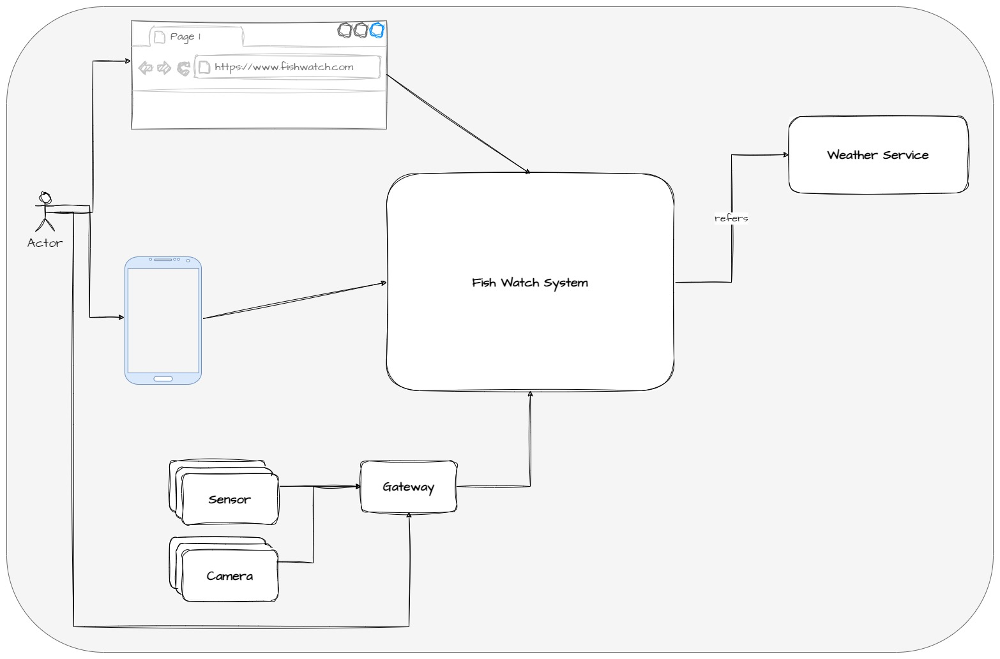
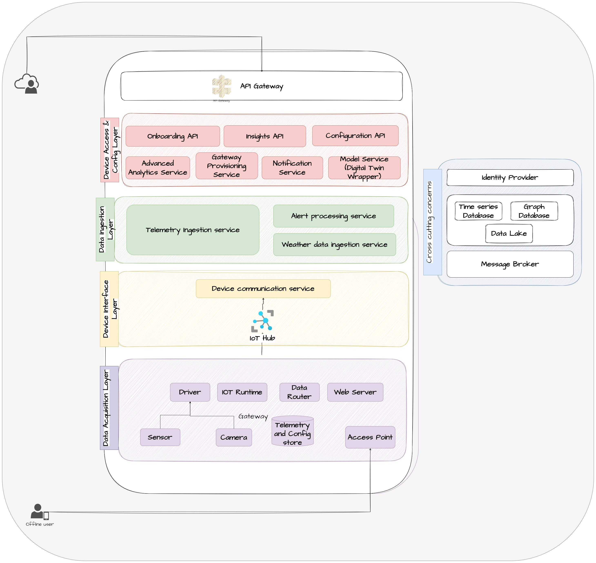
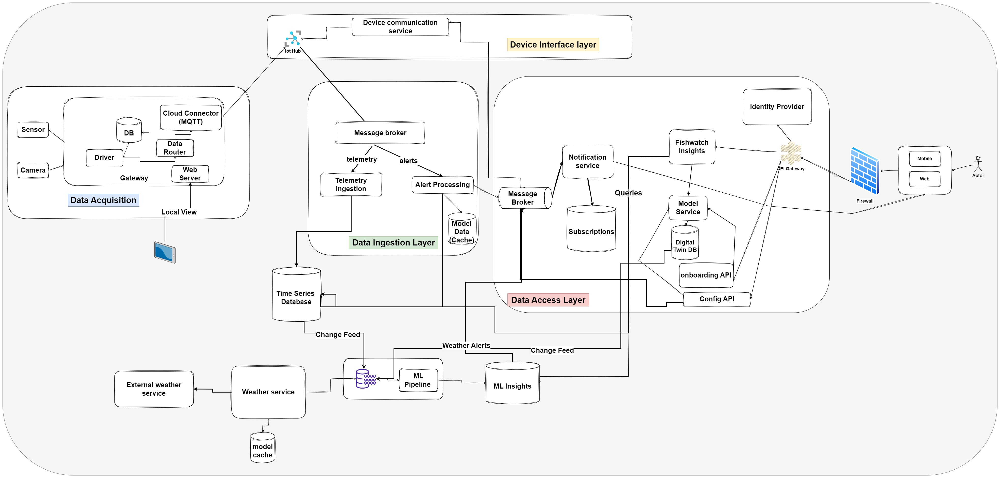

# Code Crafters Alliance

### Team Members :

- Nithin Yadalla Ramgopal 
- Sreedhar Thirunellai Raman
- Poothabalan Somasundaram
- Rahul Singh
- Suresh Muruganandam

## **Table of Contents**  

## Table of Contents 

- [Welcome to Code Crafters Alliance](#welcome-to-code-crafters-alliance)
  - [1. The Problem](#1-the-problem)
    - [1.1 Functional Requirements](#11-functional-requirements)
      - [Data Ingestion/Acquisition](#data-ingestionacquisition)
      - [Data Consolidation and Display](#data-consolidation-and-display)
      - [Data Recording and Storage](#data-recording-and-storage)
      - [Data Analysis and Alerting](#data-analysis-and-alerting)
      - [User Interface and Interaction](#user-interface-and-interaction)
      - [Prediction Model](#prediction-model)
  - [1.2 Additional Requirements](#12-additional-requirements)
    - [Security](#security)
      - [Scalability](#scalability)
  - [1.3 Users and Roles](#13-users-and-roles)
        - [Table: Users and Roles](#table-users-and-roles)
  - [1.4 Constraints and Assumptions](#14-constraints-and-assumptions)
  - [2. Solution](#2-solution)
    - [2.1 User Personas](#21-user-personas)
      - [John Doe, the farmer](#john-doe-the-farmer)
      - [Charles Xavier, the Farm Owner](#charles-xavier-the-farm-owner)
      - [Natasha Romanoff, the Farm Administrator](#natasha-romanoff-the-farm-administrator)
      - [Nick Fury, the Integrator](#nick-fury-the-integrator)
      - [Tony Stark, the System Administrator](#tony-stark-the-system-administrator)
  - [2.2 Usage Patterns](#22-usage-patterns)
    - [Need for Admin Screens](#need-for-admin-screens)
      - [*FishWatch Monitor Screen*](#fishwatch-monitor-screen)
      - [*Notification History/Alerts History*](#notification-historyalerts-history)
      - [*Sensor Trends*](#sensor-trends)
      - [*Configure Rules*](#configure-rules)
      - [*Manage Enclosures*](#manage-enclosures)
      - [Gateway Hub](#gateway-hub)
    - [*2.3 Architecture Characteristics*](#23-architecture-characteristics)
      - [*Availability*](#availability)
      - [*Data Integrity*](#data-integrity)
      - [*Data Consistency*](#data-consistency)
      - [*Fault Tolerance*](#fault-tolerance)
      - [Concurrency](#concurrency)
      - [Performance](#performance)
    - [2.4 Architecture Style](#24-architecture-style)
  - [3 System Architecture : Components](#3-system-architecture--components)
    - [3.1 System Architecture : Components](#31-system-architecture--components)
      - [Component](#component)
    - [4.2 System Architecture : Dataflow](#42-system-architecture--dataflow)
  - [4. Detailed Architecture](#4-detailed-architecture)
    - [Container Diagram](#container-diagram)
    - [4.1 Fish watch Data Model](#41-fish-watch-data-model)
    - [4.2 Microservice Independence](#42-microservice-independence)
    - [4.3 Microservice Descriptions](#43-microservice-descriptions)
      - [Overview](#overview)
      - [API Gateway](#api-gateway)
      - [Device access and Config layer (deployed globally)](#device-access-and-config-layer-deployed-globally)
        - [Gateway Provisioning Service](#gateway-provisioning-service)
        - [Onboarding API](#onboarding-api)
        - [Configuration API](#configuration-api)
        - [Insights API](#insights-api)
        - [Model Service](#model-service)
        - [Notification Service](#notification-service)
        - [Advanced Analytics Service](#advanced-analytics-service)
      - [Data Ingestion Layer](#data-ingestion-layer)
        - [Telemetry Ingestion Service](#telemetry-ingestion-service)
        - [Alert Processing Service](#alert-processing-service)
        - [Weather Data Ingestion Service](#weather-data-ingestion-service)
    - [4.4 Gateway Services](#44-gateway-services)
      - [Device Driver](#device-driver)
      - [Gateway Persistence Layer](#gateway-persistence-layer)
      - [Config and Telemetry Db](#config-and-telemetry-db)
      - [Data Router](#data-router)
      - [Web Server](#web-server)
      - [IOT Edge Runtime](#iot-edge-runtime)
      - [Wi-Fi Direct](#wi-fi-direct)
    - [Conclusion](#conclusion)
  - [5. Appendix](#5-appendix)
    - [Architecture Decision Records](#architecture-decision-records)

# Welcome to Code Crafters Alliance

We were presented with a need for developing a Fish Farm Management System FishWatch for Livestock Insights Inc.

The High level technical and Non functional requirements are as follows:

|Requirement Type|Description| 
| --- | --- | 
| **Technical Requirements** | |
| TR-01 | System should support multiple fish farms in various locations. | 
| TR-2 | System should support farms of varying sizes, from single farm customers to large clients with over a hundred farms. | 
| TR-03 | System should support multiple enclosures for fish per farm, ranging from ten to over a thousand. | 
| TR-04 | System should support large farms housing over a million fish. | 
| TR-05 | System should support a variety of different fish species per farm. | 
| TR-06 | System should integrate with water monitors in each enclosure to capture water quality information (PH, temperature, salinity, oxygen levels, etc.). | 
| TR-07 | System should integrate with underwater cameras in each enclosure to monitor fish health (size, activity, parasite detection). | 
| TR-08 | System should support a beta feature for individual fish identification via fish-ual recognition. | 
| TR-09 | System should provide customizable dashboards for farmers to view collected information. | 
| TR-10 | System should allow farmers to set alert thresholds for various factors, including PH levels and upcoming adverse weather events. | 
| TR-11 | System should track information about fish harvested from each farm. | 
| TR-12 | System should use harvested information and raw data to build models for optimizing harvests. | 
| TR-13 | System should allow large customers to derive insights across multiple farms. | 
| TR- 14 | System should define a data transmission method for hardware devices for water information capture and fish behavior detection. | 
| **Non-Functional Requirements** | | 
| NFR-01 | System should generate alerts in a timely manner to prevent potential damage from sudden water quality degradation or adverse weather. | 
| NFR-02 | System should be accessible from various devices, including rugged industrial devices used at sea. | 
| NFR-03 | System should be designed to work in remote locations with poor cellular signal. | 
| NFR-04 | System should be scalable to support future expansion to cattle and aquarium fish health monitoring. |

## 1. The Problem

### 1.1 Functional Requirements

From the problem statement, we extracted the following core requirements to guide our proposed architecture for the FishWatch system.

#### **Context Diagram**

We visualised the Context and arrived at high level the below subsystems

#### Data Ingestion/Acquisition

The data ingestion process involves reading data from various sensors and sources, such as water temperature, pH, dissolved oxygen, ammonia, turbidity, camera feeds, and weather information. This data should be collected at regular intervals, such as every 5 minutes for sensor data and hourly for weather information. The system should be able to handle this data and store it for further processing and analysis.

#### Data Consolidation and Display

The system should consolidate the data from multiple sources ( Enclosures) into a single stream. It should display data on a consolidated monitoring screen at Farmers work stations ( Rugged Tablets/MobilePhones/PCs). Each Enclosures health signs should be displayed on request,

#### Data Recording and Storage

Fishwatch must record and store detail data at least for one harvest cycle . Aggregated data can be stored and be available for view for Customers to review enclosure health and, filtering on time range and other Health parameters.

#### Data Analysis and Alerting

The system should analyze each enclosures signs for abnormalities or preset thresholds. It should alert farmers if there is a consistent variation in PH , Salinity or temperature and the alerts should be timely and configurable to meet the needs of the Farm

#### User Interface and Interaction

Fishwatch should provide an intuitive user interface for Farmers and Customers to interact with the system. It should allow the farmers and farm owner(Farm) to configure alerts, view alerts history and various other health parameters

#### Prediction Model  

FishWatch shall be able to provide predictive alerts/recommendations based on the available telemetry as well as external factors like Local weather to take appropriate actions.

## 1.2 Additional Requirements

### Security  

FishWatch should meet high data security and privacy standards in the future. It should ensure user authentication and authorization to maintain data security and privacy. It should ensure secure data exchange between different components. In this current iteration, Fishwatch shall comply with Authentication and Authorization , not adhering to safe harboring in the current scope.

#### Scalability

The system should be scalable to accommodate increasing number of Enclosure and vital sign monitoring devices. The system should be capable of handling peak loads.

- _Integration Capabilities_:   Provide APIs for further dashboarding / customization as per the Farm needs.
- _Fault Tolerance and High Availability_: FishWatch should remain operational even if individual sensors /components fail and duly report /maintain the operability status  to the system. It should implement high-availability mechanisms to minimize downtime and ensure continuous monitoring and alerting services.

## 1.3 Users and Roles

##### Table: Users and Roles

|User Role |Actions|
|----------|-------|
| Livestock® Integrator | - Add Enclosure  - Setup Farm Admin - Setup Sensors - Install App to Farm/Farmers - Test run - Setup notification |
|Farm/Farm Admin| - Setup Farm Users - View Enclosure Health -Setup Notifications -Allocate resources(Enclosure) for Farm users -Acknowledge Alerts/notification - Customize Dashboard -View Dashboard|
|Farmer(Farm user) |- Acknowledge Alerts/notification - Setup notification -View Enclosure Health -View Dashboard - Customize Dashboard 
|Livestock® Admin |- Review hardware status - Update software version - Notify Firmware updates - Monitor and maintain Database - Review uptime

## 1.4 Constraints and Assumptions

- We have developed an architecture that is fault-tolerant and ensures high availability.
- The databases in our system are considered to be a Platform as a Service (**PaaS**) with built-in redundancy mechanisms. These mechanisms provide failover capabilities to maintain service availability in the event of component failures.
- We assume that all databases will be encrypted at rest, and their data will be accessed over encrypted channels. This is to ensure the security and privacy of the data.
- We have implemented business continuity strategies that use response and recovery methods to ensure the system remains operational.
- Our architecture prioritizes data collection at the enclosure level, taking into account the variability of cellular networks and internet availability.
- We propose a hybrid architecture that can function with both on and off connectivity to the cloud.
- We assume that farmers will be provided with rugged devices or mobile devices. These devices will have Wi-Fi connectivity, allowing them to connect to the enclosure Edge Hubs on Access Points and access real-time data.
- While we have briefly discussed the roles of the system administrator and integrator, they are not the central focus of our architecture.
- System administration tasks include reviewing software and hardware health, performing updates, and backing up data.
- We assume that Livestock Inc will employ trained professionals who will set up the sensors and enclosure, making the system ready for the farm to use. These professionals will also be the point of contact for any field issues related to sensors and enclosures.
- We have intentionally not elaborated on this role in the document due to the above assumption.
- We assume that local weather data will be available through publicly accessible Weather APIs. We provide specific descriptions of such data records and related assumptions in later sections of this document.
- Our premise is that camera systems with analytics features will be available to enhance surveillance, monitoring, and decision-making processes. These cameras can stream live videos and use advanced analytics algorithms to generate useful insights, spot irregularities, and enable smart automation.

## 2. Solution

In this section, we describe user personas and usage pattern analysis, which we used to help us make specific architectural choices. Notably, these analyses guided the particular components in our architecture. Subsequently, we specify the priority of order of architectural characteristics, followed by the proposed architectural style.

### 2.1 User Personas

It is essential to identify the needs of users who will directly use the FishWatch™ system. We have come up with user personas early in architecture development so that they can guide a product that will serve users' best interests.

#### John Doe, the farmer

John Doe is a farmer who is responsible for monitoring one or more enclosures on a farm.
His duties include:
- Conducting regular rounds of the enclosures to monitor various situations and reporting them as necessary.
- Dispensing feed to the farm animals at regular intervals.
- Assessing the growth of the farm animals and determining the appropriate time for harvest.
- Administering medicine to the farm animals if any infection is detected.
- Responding to any emergencies that may arise due to weather conditions or other external factors.

John spends most of his day on the farm, attending to the needs of the enclosures and managing other operations.

It would be beneficial for him to have access to valuable information on a regular basis, enabling him to take appropriate action when necessary.

#### Charles Xavier, the Farm Owner

Charles is typically the owner of the farm and often oversees multiple locations if he owns more than one farm. As such, he rarely stays in one place for long.
- His time is primarily spent monitoring and overseeing the operations of the farm(s).
- He usually employs farmers to work on the farm.
- In the case of a single or small farm, Charles often takes on the role of a farmer himself.
- Having access to vital parameters at his fingertips improves his productivity and allows him to respond to situations in a timely manner.

#### Natasha Romanoff, the Farm Administrator

In a typical farm setting, the Farm Administrator is often also the owner of the farm. 
- However, in the case of larger farms spread across different geographical locations, the Farm Administrator is usually the person in charge of the farm.
- The Farm Administrator is responsible for creating farm users in the system and assigning enclosures to farmers, such as John Doe.
- The Farm Administrator, who could be someone like Natasha, is also responsible for monitoring the health of the farm, reviewing trends, and identifying potential issues on the farm.

#### Nick Fury, the Integrator

- Nick is responsible for setting up the LiveStock® FishWatch™ system.
- His duties include creating a Farm customer, creating farms, associating one or more gateways to the farms, provisioning the gateways, setting up sensors, configuring them, and training farmers and customers on how to use the system.
- Nick could either be a franchisee of Livestock Insights or an employee of the same company.

#### Tony Stark, the System Administrator

- Tony is responsible for understanding and maintaining all aspects of Fishwatch. He represents LiveStock Insights Inc.
- He is available on short notice to troubleshoot any issues.
- Tony ensures that the system is available at all times.
- His tasks include proactively identifying potential issues and performing maintenance at times that will not disrupt the system's functionality.
- While Tony can be notified in the event of a disaster, he prefers to have contingency plans in place ahead of time to avoid scrambling to restore the system.

## 2.2 Usage Patterns

When we started designing our solution, we found it important to thoroughly understand how this system would be used.

- The farmer can view the status of each sensor and hub using the Fishwatch(R) app.
- Each sensor operates independently and a failure in one does not affect the others.
- Alerts should be dismissible to keep the screen clear. There should be a functionality to acknowledge these alerts. In case of device failure or any other event, the farmer can notify the admin or take appropriate action.
- Both the farmer and the admin should be able to view past notifications in a separate window.
- The administrator should have the ability to assign a farmer to a specific farm or enclosure.
- There should be a screen for viewing the trend of alerts or telemetry or other ML insights over time.

### Need for Admin Screens

Given the above use cases, we have begun to organize our architecture. We have several requirements that necessitate user input, particularly for configuring rules and performing administrative activities such as role-based access and resource allocation to farmers.

By dividing the screen, we can treat the monitoring screen as a read-only display of data, with a set of admin screens available exclusively to the Farm Administrator and the Farm.

The new admin screen accepts user inputs for configuring the sensors and gateways, provides options to run diagnostics on them, and allows setting calibration offsets for the sensors.

We can define the "Model DB / Digital Twin" component as an input for setup and analysis.

Admin Screens include

- _Configure Rules:_  Elaborated in the section below
- _Manage Users:_ This section has been deliberately omitted, as this contains the basic User configuration associating them with the farms within a Farm company, and associate them with appropriate identified roles in the system.
- _Firmware updates:_ this section also been deliberately omitted , as its planned for a later iteration
- _Manage Enclosures:_ This is meant to add/ remove sensors in the system, Gateway Provisioning and registration etc. There is no specific UI defined in this, it is assumed there exists a screen.

#### *FishWatch Monitor Screen*

We started by imagining the consolidated monitoring screen that is available at Farmers Device ( Rugged/ Mobile/PC ).
An **Enclosure** and a **Livestock** are two distinct data types. The **Enclosure**  represents a physical apparatus , that the sensors are fixed to. It also houses a **Hub**, which collects data from the sensors.

The landing screen should provide the farmer with a snapshot of the current activity in the enclosure. The farmer should also be able to view different enclosures through a carousel view.

#### *Notification History/Alerts History*

Since we keep the Monitor screen neat and clean with only limited read only data, there also arises the need for showing the notification history and ability for the user to filter based on various filter conditions like

- Date range
- Enclosure
- Sensor Types

We imagined some useful notifications, and found that they fell into two categories:

- administrative alerts, which indicate simple status updates: devices disconnecting, Sensor Telemetry
- threshold alerts, which are complex to compute, which are more associative in nature or based on the rules that are configured at the Farm (Site)

This helped us figure out a key requirement for the telemetry database. It is critical that nothing impedes the sensors from writing to the telemetry database.
We decided to create a separate alerts database. Since the nature is more of writes, we chose a **Timeseries** database as the telemetry database
Splitting the database allows us to silo the sensor input database , where the rules are configured ( the digital Twin and rule DB ) to its core purpose: serving many concurrent writes, without a break.
All other functionality reads from here, processes the data, and sends it along. This split refined the design of the overall architecture. We created a clear delineation between the sensor database, and the analysis that comes after.

#### *Sensor Trends*

The Farm administrator/farmer also needs to be able to configure dashboard with important sensor parameters for him to be able to view the trends. This helped us to arrive at conclusion, that there is a need to store telemetry as well as Alerts data for an increased period of time, hence this information is to be retained in the Cloud for future analysis for the Farm as well as to run some ML Prediction models

#### *Configure Rules*

Apart from the regular telemetry, we thought it would be really powerful , if the Farm is notified on specific conditions, which involves coming up with a flexible way to setup thresholds.
The Rule Alert processor is integral to the alert processor, which on satisfying a certain condition shall initiate a new workflow.
Since this is always running and processing the incoming event/telemetry data, it drives us to define the system as an event-driven architecture for this portion of the system.

#### *Manage Enclosures*

Manage enclosure is the core setup feature of the system, which includes activities like

- _Adding Enclosure_:
    Registering the Hub to the Fishwatch system
    Device provisioning
  
- _Configure Sensors_:
    Sensor parameters and telemetry configuration

The Above Requirements drives us to the need of a device Provisioning service and a IOT Hub . This is explained in detail in the subsequent sections.

#### Gateway Hub

The requirement of a Gateway Hub, came with need that cellular signals and connection to mainland is wavery.Hence we need a Hub at the enclosure to collect the data locally and syncronizing them to Cloud , when the connectivity is restored.

### *2.3 Architecture Characteristics*

#### *Availability*

_Reason_:  Every region (EU, Americas,APAC etc) has its independent deployment of Telemetry DB, which are then aggregated globally for a multi national corporate. The System supports a small farm to real cross regional enterprise. Fishwatch primary purpose is to monitor enclosure health in real time, any system downtime could delay the detection of critical issues, leading to potential harm or even loss of business for its customers. High availability is also needed to ensure that alerts for abnormal conditions are delivered promptly, enabling customers to respond quickly in emergencies.

_Impact on Architecture:_

- We have added provision for load balancing in the data ingestion module.
- We have adopted Extract-Load-Transform (ELT) architecture for running  ML Pipeline and analytics.

#### *Data Integrity*

_Reason_: Reliable Farm health monitoring systems rely on accurate and reliable enclosure data. Therefore, FishWatch needs high data integrity, meaning the data across the system must be free from incorrect modification and loss.

_Impact on Architecture:_
    - Services that are responsible for maintaining and managing the System of Record propagate changes made to the databases as change data capture events or by publishing the change feeds to a message broker. This allows services within different bounded contexts to build their derived databases according to their specific needs.

#### *Data Consistency*

_Reason:_ The Fishwatch system must ensure that the sensor readings, which are ingested, stored, and displayed, accurately reflect the current state of the enclosure. Given that the data is event-driven and lacks transactions, we have opted for eventual consistency for telemetry data over an ACID-compliant store. Additionally, we chose a graph database to persist the digital twin information due to the complex relationships between entities and the need for high performance.

_Impact on Architecture:_
  - Telemetry data stored in regionally deployed instances is asynchronously pulled at regular intervals to populate the global data lake store. These delays are acceptable as the information in the data lake store is used for training the model and deriving ML insights by inferring the trained models. In this context, eventual consistency is acceptable.
  - The Model service will ensure that any changes made to the model/digital twin are published. This allows other microservices interested in this data to create their own copy of the model/digital twin data. These changes occur infrequently, so relying on "Eventual Consistency" is a suitable approach in this context.

 
#### *Fault Tolerance*

_Reason:_ The Fishwatch system must maintain service even in the face of failures. The primary failure scenarios include loss of connectivity between the enclosure and the cloud, sensor malfunctions, or software component failures. Despite these potential issues, it's essential for the Fishwatch system to continue monitoring, recording, analyzing, and alerting based on the available data.

_Impact on Architecture:_

- We store and process each telemetry timeseries independently from the others.
- Our design includes the ability to detect sensor failures and alert a data/system administrator about these failures.
- We have also incorporated the ability to seamlessly ingest data after a failed component recovers, leveraging the distributed message broker architecture.

To tolerate failures, the system must consider redundancy and replication at various levels. These considerations are assumed to be implicit and have minimal impact on the software architecture. We have intentionally omitted the role of an orchestrator like Kubernetes in ensuring that all services maintain a steady state.

#### Performance

_Reason:_ The system should be able to process requests on demand and be very responsive. The System also should be able to provide a consolidated view in the Monitor screen with avg response time <  5 secs

_Impact on Architecture:_

- We have chosen a regional digital twin DB to maintain specific configuration.
- We have adopted interactions to be asynchronous where a response is not needed.
- We have designed the serverless services to handle concurrent requests and scale horizontally.

### 2.4 Architecture Style

We recommend a combination of microservice and event-driven architecture styles.

- Microservice architecture will allow keeping services of the system discrete, enabling fault tolerance and high availability.
- Event-driven architecture will enable real-time capabilities. Various components can subscribe to events and receive them as asynchronous messages. eg: a Live Alert can be immediately served to the User interface and parallelly this message can be queued and processed to the database, there by making it near real-time and decoupling them.
- As in microservices, we have minimised data sharing among microservices, The Event driven module ( Alerts and Notifications) uses Telemetry Databases, while Manage Enclosures and Rules uses a GraphDB as it allows us to define complex relationships . The shared database style is suitable because Fishwatch MonitorMe needs to prioritize data integrity and maintainability over data isolation .
- We have followed, Global-Regional Hybrid architecture for deploying our services. The deployment looks at a high level as shown below: 

Architecture decision records for Global Regional Deployment model can be found at [ADR-001-global-and-regional-deployment.md](./adr/ADR-001-global-and-regional-deployment.md), Distributed Microservice architecture [ADR-002-distributed-microservices-architecture.md](./adr/ADR-002-distributed-microservices-architecture.md), Availability per region [ADR_Availability_Per_Region](./adr/ADR-005-Availability_Per_Region.md)

## **3 System Architecture : Components**

### **3.1 System Architecture : Components**

#### Component

Based on the user persona and usage patterns analysis, we have broken system architecture into six high-level components:

1. Data Acquisition:

    - Interfaces with the various monitoring devices to retrieve real-time data on enclosures.
    - Buffering the data at Hub layer, till connectivity is restored
    - Ensures reliable and continuous data acquisition from all sources, handling potential errors or disruptions gracefully.
2. Device Interface :
    - Provision device on cloud during commissioning.
    - maintain device connection status
3. Data Ingestion/Processing :
    - Receives the raw sensor telemetry collected by the data acquisition component, stores, and processes it for further analysis.
    - Includes tasks such as data normalization, validation, aggregation, and analysis to derive meaningful insights from the raw data.
    - Performs real-time analysis to detect abnormalities or threshold violations in vital sign readings, triggering alerts for medical professionals.
4. Data Access/Config :
    - Responsible for presenting the processed sensor data to various screens in a user-friendly format.
    - Includes functionalities such as displaying sensor data on monitoring screens at Fishwatch Monitor and sending alerts to subscribers such as farmers/Administrator etc.
5. Data Administration:
    - Enter metadata such as thresholds and rules for generating alerts on vital sign signals.
    - Configure Sensor behaviors
    - User Management
    - Generate on-demand data snapshots and reports.
    - Generate historical reports.
6. Cross Cutting Concerns
    - Process ML Pipelines through Data Processing
    - Ingest External data to data lake like Weather Info.
    - Manage Authentication/Authorization
    - Maintain /Manage Master config database

### **4.2 System Architecture : Dataflow**

The system adheres to a specific data flow pattern to ensure efficient data processing and management. The data flow can be outlined as follows:

1. *Data Ingestion:*
    - Sensors installed in farm enclosures generate point values, each having an ID and a sensed value. Every gateway and sensor onboarded into the system is assigned a globally unique identifier. The point ID is a combination of the gatewayId and sensorId. These unique identifiers offer the following benefits:
    - All points sent to the cloud can be easily tracked using this ID.
    - When faulty sensors are replaced, these soft identifiers can be retained, ensuring historical continuity.
    - Configured cameras detect and report alerts.
    - Weather data from all farm locations is periodically extracted from external weather providers and stored in the data lake.
    - User configurations are persisted in the global digital twin store.

2. *Data Processing:*
    - The Gateway component performs real-time basic stream analytics on the collected telemetry data from all sensors, refers to the set configuration, and generates alerts.
    - Advanced analytics services process the data, detect anomalies, and generate alerts.
    - Reported inclement weather conditions also trigger alert generation.

3. *Data Storage:*
    - Telemetry data is stored in regionally deployed time series databases, considered as the "System of Records".
    - The globally deployed data lake house periodically pulls data from the regional time series databases. This global data lake house is the derived database.
    - The global graph database stores the model (digital twin) information, device configurations, and user preferences.
    - Regionally deployed model databases create a copy of the model information by processing the change feed/change data capture events from the global graph database.
    - Upon successful saving of rule configurations on sensors and cameras in the model database, the same configurations are downloaded to gateways for storage.

4. *Data Output:*
    - The analyzed data or derived results are presented to end-users or other systems in a consumable format, such as reports, dashboards, APIs, or other data delivery methods.
    - Generated alerts are sent to users as email, SMS, or push notifications, according to the user's configured preferences for alert notifications.

## 4. Detailed Architecture

### Container Diagram

### **4.1 Fish watch Data Model**

The main data model of Fishwatch is split into 2 types and we have 3 varieties of Data Stores.

1. **Fishwatch DataModel**
    The Fishwatch data model is envisioned as a Graph Database where the relationships are maintained and all the data administrative data is maintained.
    The relationships are defined as depicted in the diagram below:

    

*Rationale*: The Decision for the GraphDB is recorded in the [ADR_GraphDB](./adr/ADR-003-graphdb-for-persisting-digital-twin.md)

*Note*: The System is designed extensible, the Same model can be extended to other livestocks with a similar setup,

2. **Telemetry DataModel**

We chose to follow Cloudevents model for storing Telemetry events in the system. the Data Processor module converts and stores the data in the below Model. The Schema is loosely defined as below.
The data is stored in the telemetry database which is a timeseries documennt DB hosted as a PaaS service in the Cloud.

|CloudEvents| Type| Exemplary JSON Value|
|-----------|-------|-------------------------|
|type |String| "com.codecraftersalliance.evt.v1"|
|specVersion| String| "1.0"
|source|URI-reference| "/skaneFarm/gateway01/temp01"|
|subject|String| "temperature value"|
|id |String |{farmId.gatewayId.sensorId} - ed102250-9e1d-4b47-a211-6c38bf23f3f8.a3cfa3b4-1a31-4eab-9abb-e9f11ad414f8.100b8ed7-4741-452a-9bd9-26ec59dbd4ec|
|value|String|"25"|
|reportedAt|Timestamp| "2024-04-05T17:31:00Z"|
|time |String| "application/json"|
|data |String| {"key1":"value1", "key2":"value2"}|

The Cloud Events model is explained in detail in the document link [CloudEvents Model](./Cloudevents-json-format.md)

*Rationale*:

- The decision for selecting CloudEvents model is recorded in the [ADR_CloudEvents](./adr/ADR-006-CloudEvents.md).
- Timeseries Database selection is recorded in the [ADR_TimeseriesDatabase_For_Storing_telemetry](./adr/ADR-009-timeseriesdatabase_for_storing_telemetry.md)

### **4.2 Microservice Independence**

Each Important microservice shall maintain a model copy of relevant information to maintain their independence. This is achieved through: 

- Model Service emits Change Data Capture (CDC) events to a message broker, which Notification service and Alert processing services subscribes to. 
- Once CDC events are received by these 2 services, they transform them as needed before persisting them. This design ensures loose coupling and independent scalability of both services.

This ensures, that there is a single Source of truth as Model DB, but relevant services shall have its own local copy as per their needs.

The detailed flow for creating local copies that can be independently scaled along with the owner service is shown below: 

### 4.3 Microservice Descriptions

#### **Overview**

In our system architecture, we have implemented several microservices to handle specific functionalities. Each microservice is designed to serve a specific purpose and contribute to the overall system's functionality.

#### **API Gateway**

Here are the reasons why we utilize an API Gateway:

- All APIs exposed to the external world are routed through the API Gateway, providing a single entry point for all external requests.
- The API Gateway integrates with the identity provider and authenticates all incoming requests, ensuring security.
- The API Gateway performs basic parameter validation, ensuring data integrity.
- It maintains an allow or deny list and makes decisions accordingly, providing an additional layer of access control.
- It provides a mechanism for rate limiting to prevent Denial of Service (DoS) attacks, enhancing system resilience.
- The API Gateway allows for the replacement of API routes of services with new ones, without impacting the consumers, ensuring seamless updates.
- It provides a provision to implement circuit breakers in case any of the downstream services are temporarily unavailable, improving system reliability.
- Global error handling can be performed at the API Gateway, centralizing error management.
- Logging and monitoring can be done at a central place through the API Gateway, simplifying system oversight and management.

#### **Device access and Config layer (deployed globally)**

##### **Gateway Provisioning Service**

*Premise:*

Each manufactured gateway comes pre configured with authentication credentials and is assigned a specific Gateway Provisioning Service API endpoint. The Gateway Provisioning Service also updates its enrollment list accordingly.

*Purpose**:

- When the gateway is powered on for the first time, it connects to the Gateway Provisioning Service endpoint and presents its authentication credentials.
- The Gateway Provisioning Service verifies the gateway's identity against its enrollment list.
- Once the gateway's identity is confirmed, the service assigns the gateway device to an IoT hub and registers it in the hub based on the region of the farm to which the gateway is associated.
- The Gateway Provisioning Service receives the unique gateway device ID and registration information from the assigned hub and relays this information back to the gateway device. The gateway then uses its registration information to connect directly to its assigned IoT hub and authenticate itself.
- Following successful authentication, the gateway and IoT hub commence direct communication. The Gateway Provisioning Service's role as an intermediary concludes at this point, unless the gateway requires re provisioning in the future.

The Decision rationale for going for an IOT Hub is in this ADR : [ADR_IOTHub](./adr/ADR-008-IOTHub.md)

##### Onboarding API

*Purpose*:
This API provides all the essential endpoints for adding a farm company, farm, enclosure, gateway, sensors, cameras, and users.

##### Configuration API

*Purpose*:

- This API houses all the necessary endpoints for associating a gateway with a farm, enabling a user to save their notification preferences, setting sensor thresholds for alerts, choosing preferred metrics or details to be displayed in the web interface, selecting a preferred language, and determining the preferred units.

##### Insights API

*Purpose*:

- This API is built on GraphQL (for reasons behind choosing GraphQL, refer to the ADR: [adr_InsightsAPI_GraphQL](./adr/ADR-007-insightsAPI_graphql.md)). Upon successful user login, the API retrieves all necessary details for the farms the user has access to and organizes these farms based on their respective regions. It then initiates synchronous API calls to all regional APIs to gather the required data, such as alarms or telemetry. This data is consolidated and relayed to the caller. However, it's crucial to note that tail-end latencies can potentially impact the performance of this API. Additionally, this API is equipped to fetch insights generated by the advanced analytics service.

##### Model Service

*Purpose*:

This acts as a facade for the digital twin data stored in the graph database (for reasons behind choosing a Graph database, refer to the  ADR :[ADR_GraphQL](./adr/ADR-003-graphdb-for-persisting-digital-twin.md)). It offers options to create various vertices, edges, and their corresponding attributes, facilitating efficient querying and retrieval of required results.
Additionally, this service publishes change feed or change data capture events to a message broker. This allows other services that rely on digital twin information to build their own copies in the format that best suits their needs. This feature enhances the scalability, flexibility and adaptability of the system, ensuring that all services can effectively utilize the digital twin data.

##### Notification Service

*Purpose*:

- This service operates as a background service that continuously listens to a message broker, such as an Azure Event Hub.
- Alert processing services, deployed in various regions, publish alerts to this same message broker. Similarly, weather data ingestion services in different regions publish alerts related to inclement weather conditions to the same broker.
- The Global Advanced Analytics service also publishes any alerts based on detected anomalies to this message broker.

The Notification Service processes these alert messages, refers to the model service to enrich the context, and sends notification alerts based on user-configured preferences. This ensures that all relevant alerts are efficiently processed and delivered according to user preferences, providing a comprehensive and personalized alert system.

##### Advanced Analytics Service

*Purpose*:

- This service includes a data lake house that aggregates all telemetry data from regional deployments, as well as a machine learning (ML) training component. It also maintains a persistent database to store insights for future use.
- The service features an API that utilizes the trained model to predict the yield based on a given set of parameters.
- Furthermore, if the service identifies any anomalies, it promptly sends alerts to the notification service. This ensures immediate awareness and facilitates timely response to potential issues.

#### Data Ingestion Layer

##### Telemetry Ingestion Service

*Purpose*: This service processes the stream of telemetry data (coming from IoT hub) related to points and their values, and persists them in the time series database.

##### Alert Processing Service

*Purpose*: This service monitors alert messages sent by the gateway as part of the telemetry. It enriches these alerts by referring to its own replica of the digital twin model database, stores them in the time series database, and then publishes them to a message broker (like Azure Event Hub). This allows the alerts to be processed by the global notification service.

##### Weather Data Ingestion Service

*Purpose*: This is a continuously running background job that fetches weather information for all locations where farms are situated. The list of farms and their locations is retrieved from its own replica of the digital twin model database. The service then stores this weather data into the time series database.

### 4.4 Gateway Services

#### **Device Driver**

*Purpose*: It has the responsibility to discover and communicate to the different varieties of sensors and cameras. It caches the threshold settings for each of the sensors enrolled and it has the intelligent to detect the sensor malfunctioning and raise it as an alert and write it to the Data Access Layer. If any new category of sensor need to be brought to the system, this component need to be enhanced to accommodate those new one. It writes the telemetry data to the Configuration Database via Data Access Layer. It does the periodical checks from Data Access Layer for any threshold and Configuration changes.

#### **Gateway Persistence Layer**

*Purpose*: This component acts as an abstraction layer for read\write configuration and to write the Telemetry data to the Database. This has the configuration setting to  manage the data retention in the configuration db. This component will be invoked by Data Router for streaming the Telemetry to the IOT edge Runtime and by the web Server for local viewing.  

#### **Config and Telemetry Db**

*Purpose*: This database will persist the sensor, threshold and telemetry data. Telemetry data will be retained based on time. Persisting the telemetry data or alarms serves for two purposes:

- If the Gateway loses the connectivity with the Device Interface layer, the time series data can be persisted so that when the connectivity restores, data can be streamed back to the cloud.
- Since these Gateway will be installed in a remote shore there are more possibilities for network disturbances, during these time, Farmer who is in-charge can connect with the Gateway via Wi-Fi direct and stream the data locally to understand the enclosures health status

#### **Data Router**

*Purpose*:  It acts as a pass through layer for reading the data from Data layer to IOT Edge Runtime and also to receive the configuration data from IOT Edge Run time to Data Layer.

#### **Web Server**

*Purpose*:  This acts as an interface for reading the data from Data Layer and serve the minimal health and telemetry data to the Farmer who is in charge of the Farm during the time of disconnection.

#### **IOT Edge Runtime**

*Purpose*:  This manages the connectivity to the cloud system, in cases of disconnection with the cloud, it signals the Data Router to start streaming the telemetry data to local persistence store.  Once connectivity is restored it again signals the Data Router and in turns it start streaming the persisted data to cloud which are buffered in local persistence store.

#### **Wi-Fi Direct**

*Purpose*: Connectivity to the Wi-Fi direct to the local hand held devices are not explicitly elaborated, it is assumed that farmer can connect with the Gateway in the event of Gateway disconnection with the cloud.

### Conclusion

These microservices work together to provide a scalable and modular architecture, allowing us to efficiently handle different functionalities within our distributed system.

## 5. Appendix

### Architecture Decision Records

1. [ADR_GLobal_and_regional_Deployment](./adr/ADR-001-global-and-regional-deployment.md)
2. [ADR_Distributed_Microservices](./adr/ADR-002-distributed-microservices-architecture.md)
3. [ADR_GraphDB](./adr/ADR-003-graphdb-for-persisting-digital-twin.md)
4. [ADR_Local_Storage_In_Gateway](./adr/ADR-004-Local_Storage_In_Gateway.md)
5. [ADR_Availability_Per_Region](./adr/ADR-005-Availability_Per_Region.md)
6. [ADR_CloudEvents](./adr/ADR-006-CloudEvents.md)
7. [ADR_InsightsAPI_GraphQL](./adr/ADR-007-insightsAPI_graphql.md)
8. [ADR_IOTHub](./adr/ADR-008-IOTHub.md)
9. [ADR_timeSeries_For_Storing_Telemetry](./adr/ADR-009-timeseriesdatabase_for_storing_telemetry.md)